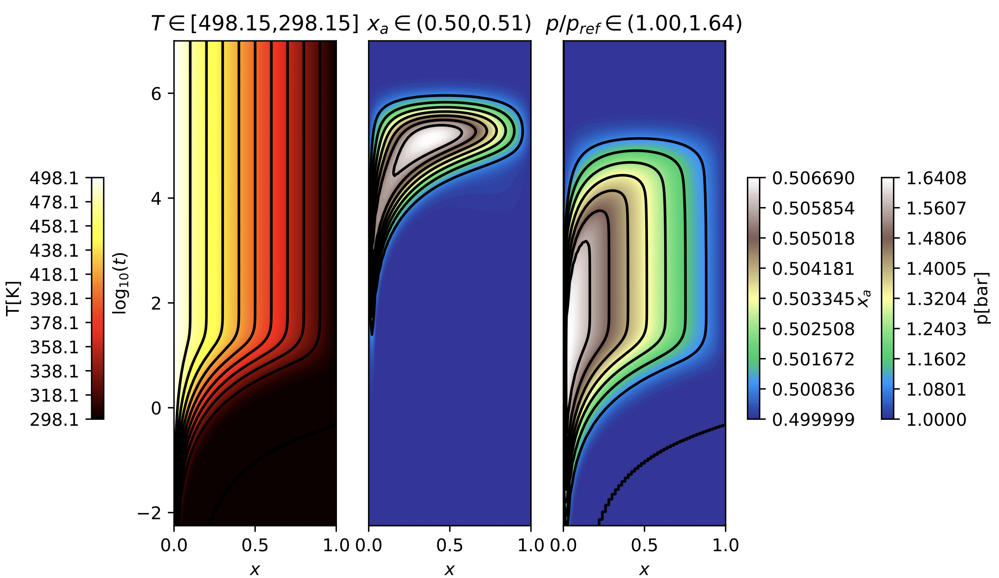

# Nonisothermal-dusty-gas-model
Supplementary to 
 **Vágner**, **Pavelka**, **Klika**, **Fuhrmann** *A multiscale thermodynamic generalization of Maxwell-Stefan diffusion equations and of the dusty gas model. International Journal of Heat and Mass Transfer*, (2022), [doi: 10.1016/j.ijheatmasstransfer.2022.123405](https://doi.org/10.1016/j.ijheatmasstransfer.2022.123405) or [arXiv:2206.14930](https://arxiv.org/abs/2206.14930)

Repository contains a [Pluto.jl](https://github.com/fonsp/Pluto.jl) notebook finite-volume implementation of nonisothermal dusty gas model. The code relies on the finite-volume solver package [VoronoiFVM.jl](https://github.com/j-fu/VoronoiFVM.jl).

To run the notebook you will need to have [Julia](https://julialang.org/downloads/#current_stable_release) with [Pluto.jl](https://github.com/fonsp/Pluto.jl#ingredients) package installed.

*Transient simulation of temperature step of binary dusty gas model.*

